# utn.adminet
Proyecto realizado como trabajo en equipo para la materia de desarrollo web, creando un sistema de administración usando una BD

Esta aplicacion web genera reportes en pdf de la informacion guardada

Link: https://dannyvega-studio.github.io/utn.adminet/

al iniciar encontramos el login.php en el cual ingresamos el usuario asignado por default (usuario: admin / contraseña:password)

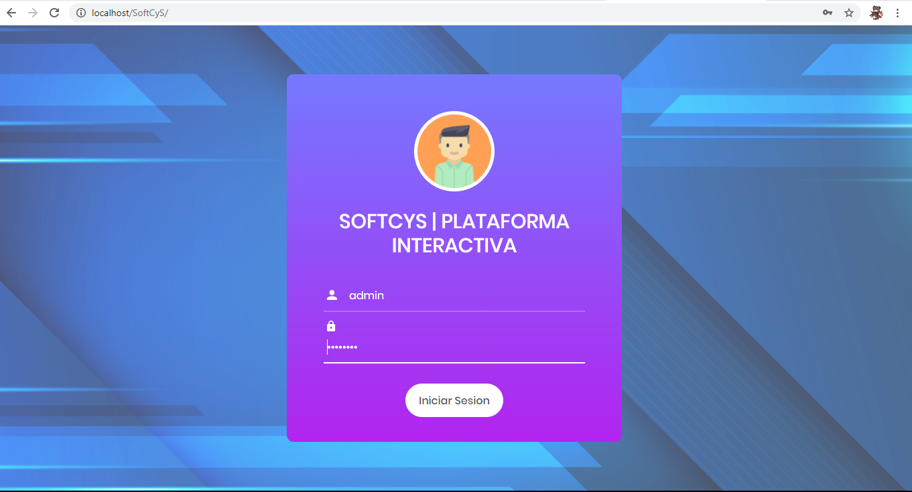

luego se muestra la pagina de inicio la cual solo contiene un carrusel ilustrativo de informacion de la empresa C&S.

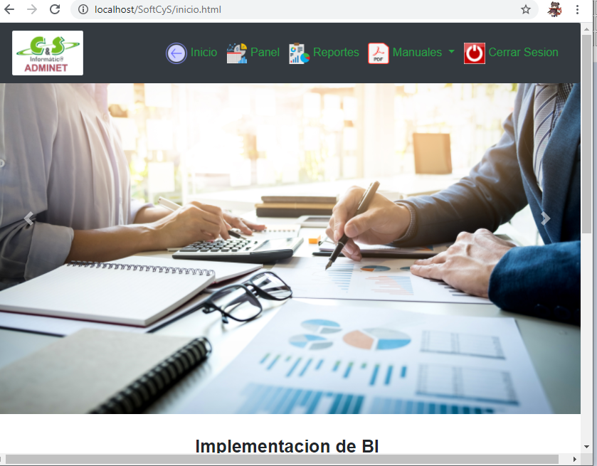

la seccion de PANEL donde encontramos las diferentes categorias que se pueden administrar (EMPLEADOS, CONTRATOS, SERVICIOS, EMPRESAS ,ETC)

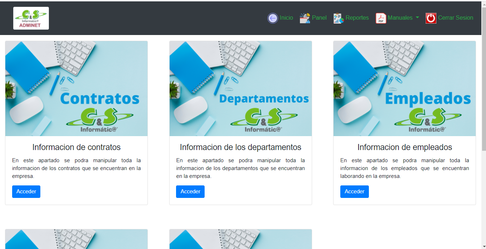

despues de acceder a cualquier segmento del panel se muestra la siguiente ventana que posee un cuadro de bienvenida y una tabla con la informacion que contiene actualmente la BD

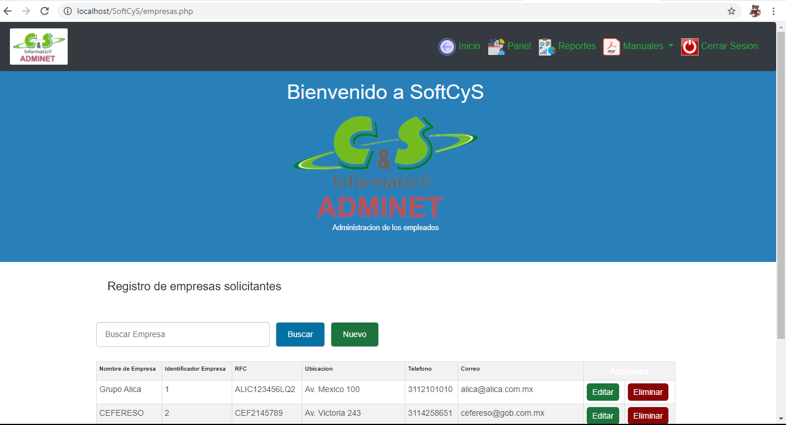

al dar click en el boton NUEVO nos aparece el siguiente formulario, en el cual el usuario ingresa la informacion, cabe mencionar que por validaciones de campo el usuario no puede dejar campos en blanco y/o que no cumplan con el tipo de dato y/o el formato (ejemplo el correo, rfc, telefono)

OJO: este mismo diseño se aplica en el formulario de EDITAR, con la diferencia de que en este los campos ya se encuentran llenos con la informaicon, solo es modificar algun error de captura.

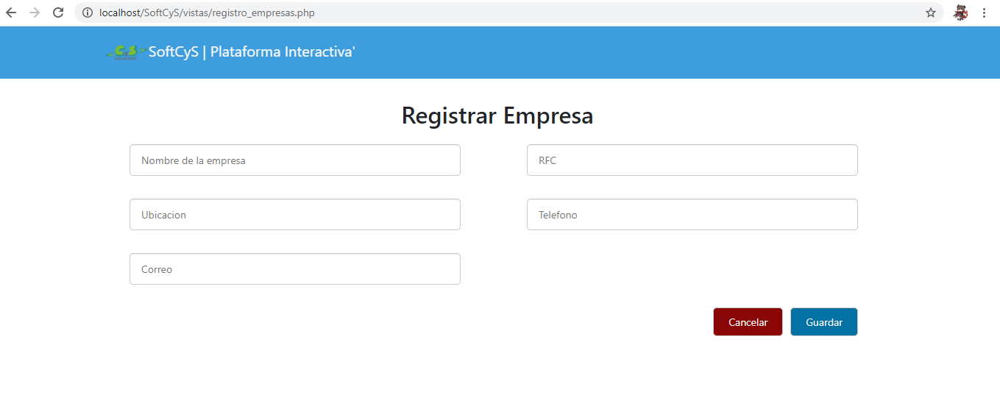

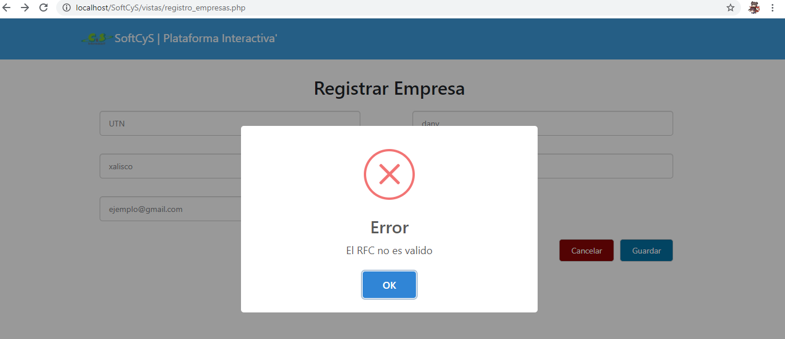

Una vez todos los datos son correctos se muestra un mensaje de registro exitoso y nos regresa a la ventana de la seccion donde se mostrara que ha añadido la informacion a la tabla.

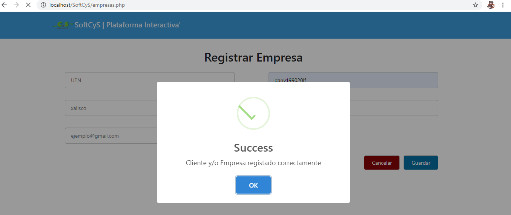

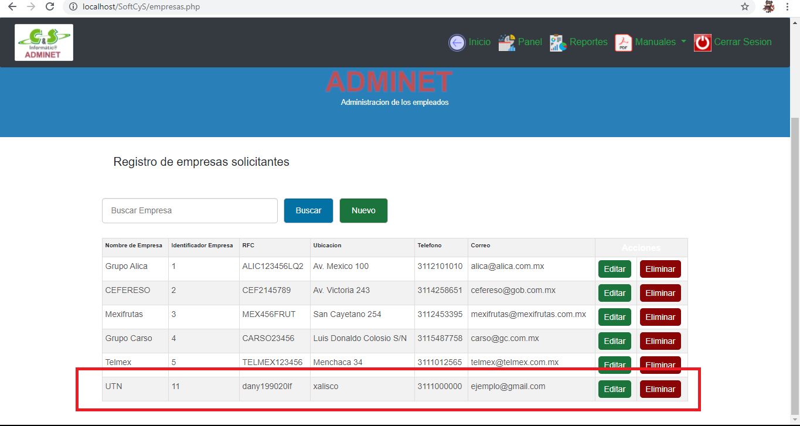

en la seccion de REPORTES, nos genera un pdf al dar click en su correspondiente boton, con la informacion de la BD correspondiente a ese segmento.

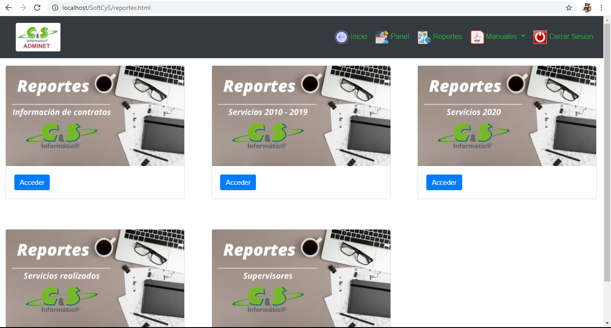

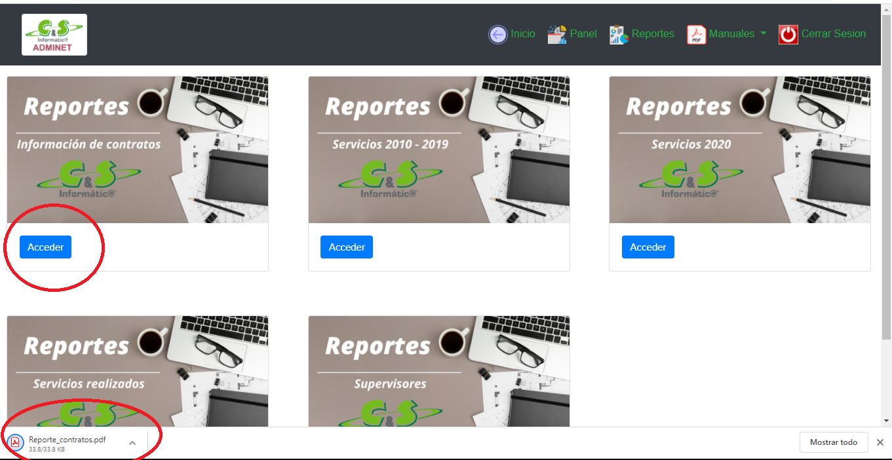

en cuanto a la seccion de MANUALES que encontramos en la barra de navegacion, este se depsliega mostrando los diferentes manuales con los que cuenta, al dar click en ellos se nos abriran en una ventana nueva.

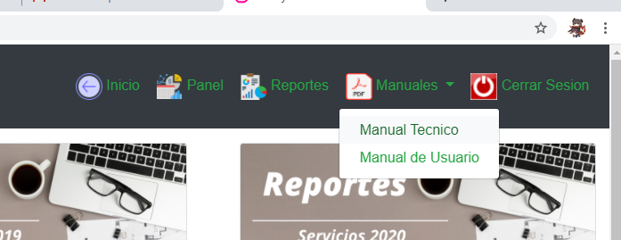

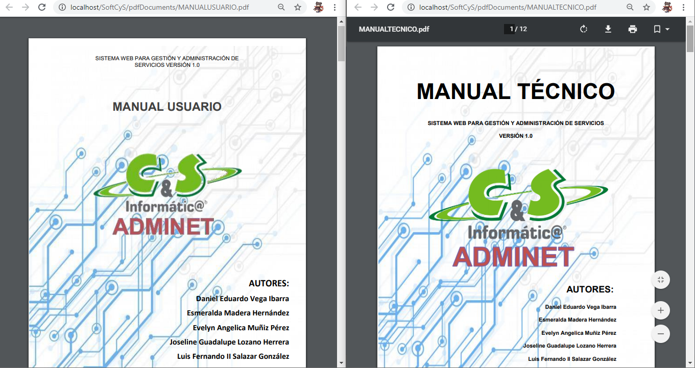
